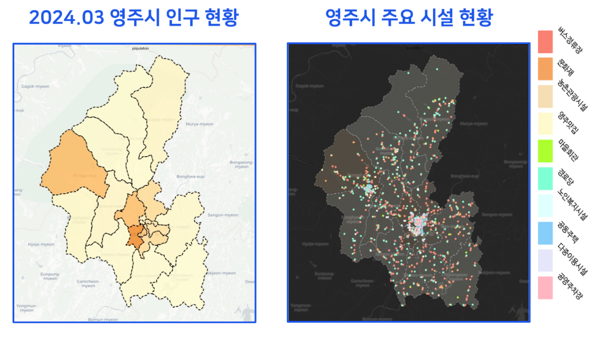
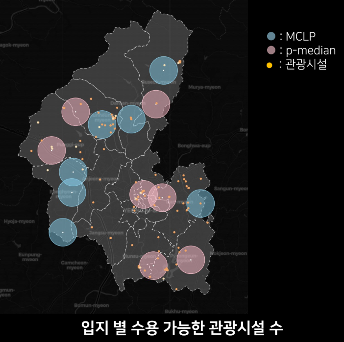

# 2024-yeongju-si-data
2024 영주시 데이터 분석 활용 공모전 참가작

---

## 1. 분석 내용 소개

| **영주시 문화, 관광 사업 활성화를 위한 여행객 쉼터 최적 입지 제안**

자세한 내용은 다음 경로의 분석 요약 자료를 참고해주세요.
    
     ./여행객 쉼터 최적입지 제안_이윤이,김소민, 김예린, 김예진.pdf

---

## 2. 담당한 부분

1) **데이터 전처리**

    - 행정동 경계 데이터, 영주시 인구현황 데이터, 공공데이터 포탈의 영주시 주요 시설 데이터 (경로당, 마을회관, 노인복지시설, 문화재 정보, 다중이용시설 현황 등) 활용
    - 카카오 지도 API 활용하여 **위도, 경도 정보 크롤링**
        
        `./전처리/data_preprocessing.ipyb` 파일 참고

2) **지도 시각화**

    - **Python Folium 패키지**를 활용하여 시각화, **html 형식**으로 저장
    - **MCLP, P-median 알고리즘**으로 도출한 **입지 선정 결과 병합 및 시각화**
    
        - **반경 2.5km를 쉼터 영향 범위**로 설정하여 Circle 함수 사용 

    -  `./시각화` 폴더 내 파일 참고

---

 ## 3. 시각화 결과
    
---

**인구 밀도 코로플레스 맵(좌), 주요시설 분포도(우)**

---
    

**알고리즘을 통해 선정된 입지 + 주요 관광시설 시각화 지도**

